# Rails Girls is My Gate to Join the Ruby Community

2024/09/07
Fukuoka RubyistKaigi 04
@maimu
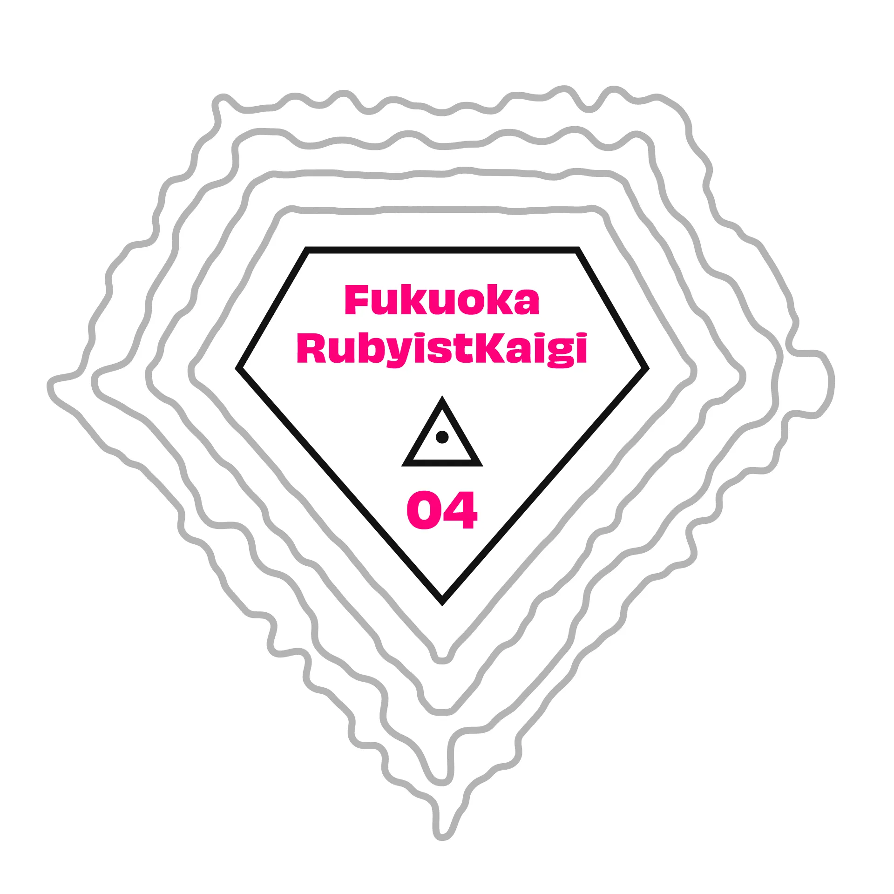

___

<!-- header: About me -->
<!-- _class: profile -->

- maimu(@maimux2x)
- company: ESM, Inc.
- A graduate of the Fjord Boot Camp.
- A member of Fukuoka.rb.

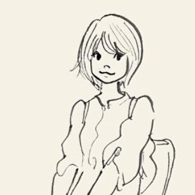

___

<!-- header: Today's title -->
<!-- _class: strong -->

Rails Girls is My Gate to Join
the Ruby Community
___

<!-- header: Agenda -->

- Introduction

- The opportunity that enabled me to actively participate in the Ruby community

- Episode1: The translation of the Rails Girls guide

- Episode2: Let's translate together

- Episode3: Lightning talk at Osaka

- Episode4: Rails Girls Tokyo16th

- conclusion

___

<!-- header: Introduction -->

- When coincidences are connected, there might be some meaning behind them.

- When you find personal meaning in something, it becomes the driving force behind what you want to do.

___

<!-- _class: pink -->

 The opportunity that enabled me to actively participate in the　Ruby community

___

<!-- _class: strong -->

Question!
___

<!-- _class: strong -->

What motivated you to start participating in the Ruby community?
___

<!-- _class: strong -->

In my case
___

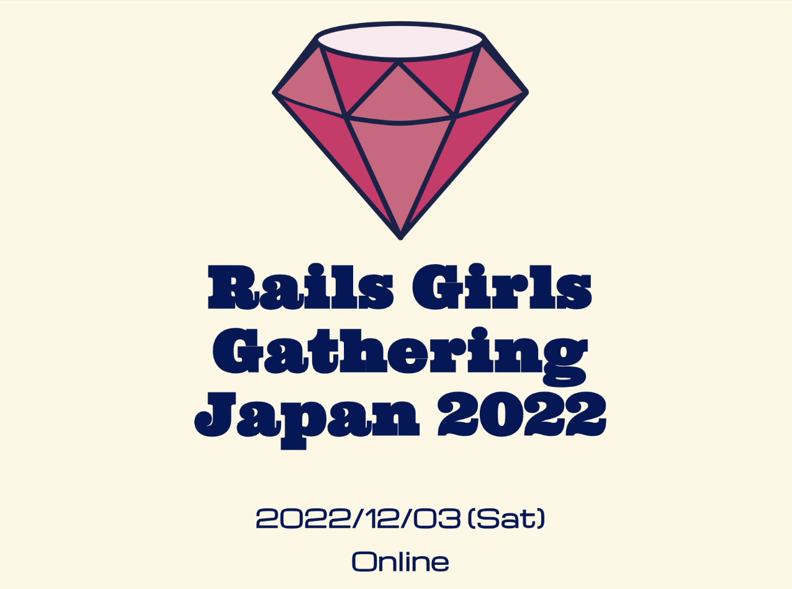

___

### The first time I had a proper conversation with the participants at the social gathering.

___

<!-- header: Encouraged to attend the event -->

- At the Rails Girls event, I met many female engineers who have built long careers, including **Emori san**(@emorima).

- While there are few women engineers at the company level, I realized that at the community level, I could connect with many experienced female engineers.

- It was the first time I spoke with **Shioi-san** at this event.
  - Spoke with me very kindly, and that made me really happy.

___

<!-- _class: profile -->

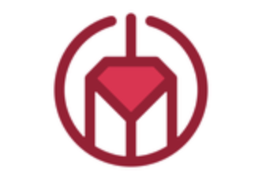

I started participating in Fukuoka.rb

because Shioi san was also attending :)

___

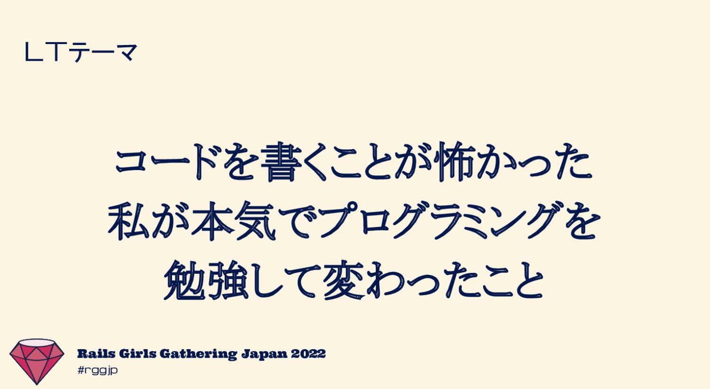

___

At this event, I talked about my experience of struggling with programming.

It was one of the highlights for me when later on, some people who remembered my presentation reached out to me in the Ruby community.

___

<!-- _class: pink -->

Episode1:

The translation of the Rails Girls guide
___

<!-- header: The trigger was a post on Slack -->

Shibata san(@hsbt) posted in the ruby-jp Slack,

asking if anyone could help translate the Rails Girls guide.

___

At that time, I was about to graduate from a Fjord Boot Camp and should have been busy, but for some reason, I found myself saying, 'I'll do it...  :p

___

- At first, I was working on it together with goh san.

- It was a great learning experience to exchange reviews for the first time on a PR with someone outside of FBC.

___

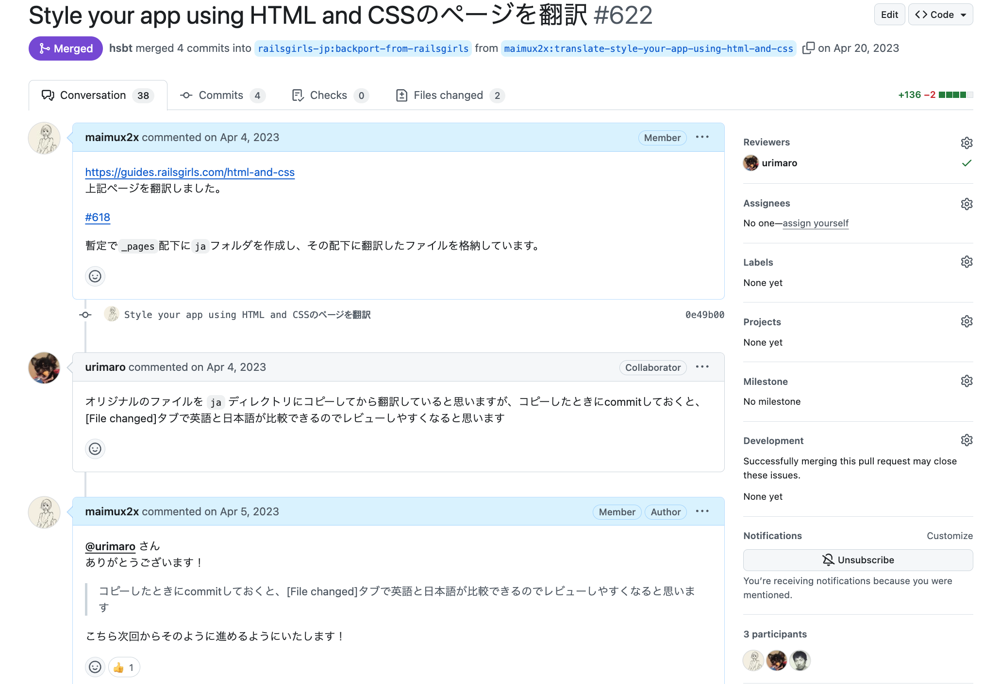

___

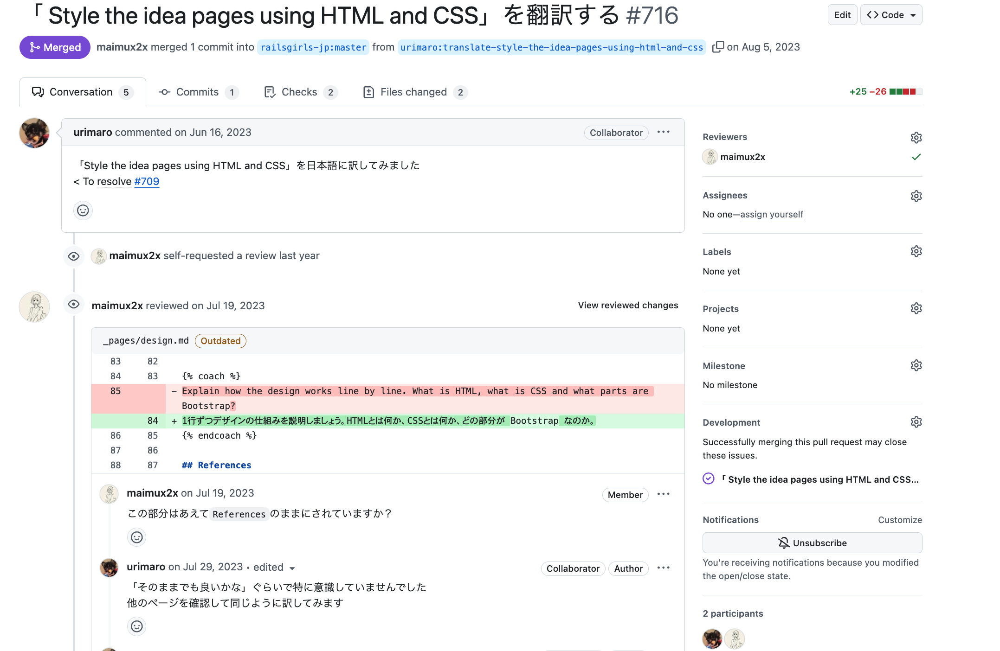
___

<!-- header: The oppotunity for change -->
<!-- _class: large-->

Shibata san adviced me

"It would be great if a few more people could help with the translation."

___

<!-- _class: pink -->

Episode2:

Let's translate together

___

### I wrote a blog summarizing the translation procedure for Rails Girls guide.
___

___

A lot of people spread my blog on X, and the number of people willing to help with the translation increased quickly :O
___

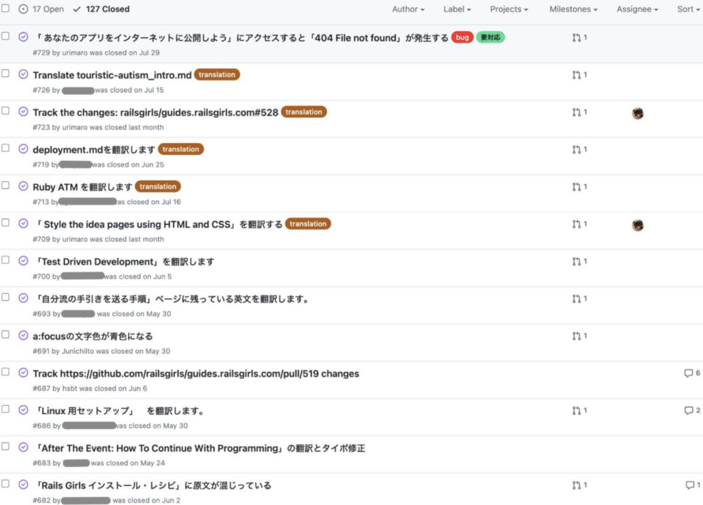

___

Until then, I had always been on the receiving end, getting inspired by the Ruby community.

But at that moment, by chance, I experienced what it was like to make an impact myself.

___

<!-- _class: pink -->

Episode3:

Lightning talk at Osaka

___

I gave a lightning talk about translating the Rails Girls guide at Osaka RubyKaigi 03.
___

After the LT, I was approached by the organizer of a Rails Girls workshop in Osaka and a representative from the company providing the venue.

___

### This conversation prompted me to reflect on my involvement with Rails Girls.

___

I was able to work hard on translating the Rails Girls guide, Because

 

- Tanks to the immense support from the Ruby community. 

- My own experience of struggling with learning Ruby on Rails motivated me.
  - Rails Girls guide outlines the steps for beginners to familiarize themselves with programming.

___

Until I participated in the Rails Girls Gathering Japan 2022 event, I didn't know about the existence of Rails Girls.

I thought there might be many women interested in programming who are in the same situation.

___

### I’m thinking of trying to be an organizer for a Rails Girls workshop in Tokyo.

___

<!-- header: Behind the scenes -->

___

When I applied to give a lightning talk at Osaka RubyKaigi 03, I was actually planning to present on a topic unrelated to Rails Girls.

However, after receiving a message from Fjord Boot Camp's mentor, Ito san, I decided to focus on translating the Rails Girls guide as my presentation topic.

___

If I hadn't received that message, there's a good chance I wouldn't have presented in Osaka, and I might not have considered becoming a Rails Girls organizer either q:

___

<!-- _class: pink -->

Episode4:

Rails Girls Tokyo 16th

___

As a result of reaching out on the Rails Girls JP Slack about wanting to hold a workshop in Tokyo, I found out that **Angel san** from STORES  Inc was also interested in hosting one, and we ended up organizing it together <3

___

<!-- header: Rails Girls Tokyo 16th's Theme -->

# The Gate of Programing

___

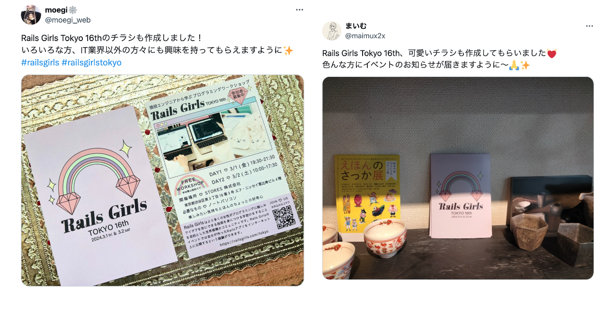

___

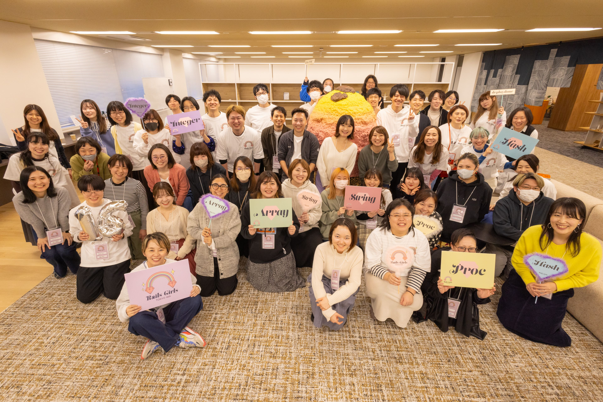
___

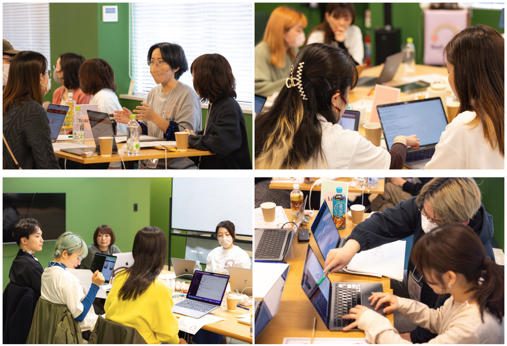

___

## Girls working hard to become engineers after the Rails Girls Tokyo 16th workshop!

___

<!-- _class: pink -->

Conclusion

___

After attending a Rails Girls event, I happened to get involved in translating the Rails Girls Guide.

Through that interaction, I found the motivation to organize the Rails Girls Tokyo 16th workshop!

___

  ## Is there anyone here who is attending a Ruby community event for the first time today?
___

# Fukuoka RubyistKaigi is Your Gate to Join the Ruby Community :D
