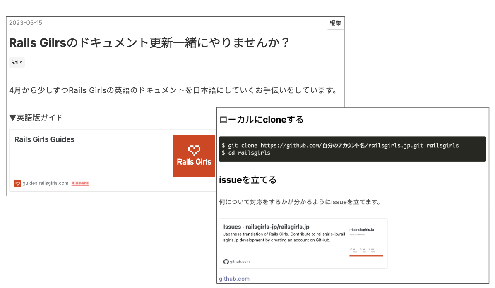

# Rails Girls is My Gate to Join the Ruby Community

2024/09/07
Fukuoka RubyistKaigi 04
maimu

___

<!-- header: About me -->
<!-- _class: profile -->

- maimu(@maimux2x)
- 所属: 永和システムマネジメント株式会社
- Fjord Boot Camp卒業生
- Fukuoka.rbメンバー

___

<!-- header: Today's title -->
<!-- _class: strong -->

Rails Girls is My Gate to Join
the Ruby Community
___

<!-- header: Agenda -->

- Introduction

- Episode1: The translation of the Rails Girls guide

- Episode2: Let's translate together

- Episode3: Lightning Talk at Osaka

- Episode4: Rails Girls Tokyo16th

- Conclusion

___

<!-- _class: pink -->

Introduction
___

偶然の出来事の中に自分なりの意味が見つかると、そこから「〇〇をしたい！」というモチベーションが生まれることがある

___

<!-- _class: strong -->

質問です！
___

<!-- _class: strong -->

Rubyコミュニティに参加するようになったきっかけは何でしたか？
___

<!-- _class: strong -->

私の場合
___

___

### 懇親会で参加者の方と初めてちゃんと会話をした

___

<!-- header: Encouraged to attend the event -->

- 江森さん(@emorima)をはじめエンジニアとして長くキャリアを築いている女性の存在を知った

- しおいさん(@coe401_)と初めて会話をした

___

<!-- _class: profile -->

Fukuoka.rbに参加し始めたきっかけは

しおいさんが参加されていたからでした

___

___

- FBCに入る前のプログラミング学習の挫折についてLTをした

- 共感だったり色々な感想をいただくことができて嬉しかった経験

___

<!-- _class: pink -->

Episode1:

The translation of the Rails Girls guide
___

<!-- header: The trigger was a post on Slack -->

柴田さん(@hsbt)がruby-jpのslackに

「Rails Girlsガイドの翻訳を手伝える方はいませんか？」

と投稿されているのを偶然見つけた

___

FBCの卒業間近で自作サービスの開発で忙しかったはずが・・・

反射的に「やります！！」と返信していた  :p

___

- はじめはgohさん(@urimaro)と二人作業

- レビューのやり方などたくさんアドバイスをいただいた

___

___

___

<!-- header: The oppotunity for change -->
<!-- _class: large-->

柴田さんと

「翻訳に協力してくれる人がもう少し増えるといいですね」

という会話をした

___

<!-- _class: pink -->

Episode2:

Let's translate together

___

### PRを作成するまでの流れをブログにまとめみた
___

___

たくさんの人がXでブログを拡散してくれた！

___

___

それまでの自分はコミュニティからきっかけをもらうことが多かった

___

自分がきっかけとなり一つのことに一緒に取り組む初めての経験
___

<!-- _class: pink -->

Episode3:

Lightning Talk at Osaka

___

大阪Ruby会議03でRails Girlsガイドの翻訳についてLTをした
___

大阪でRails Girlsのオーガナイザーをされた方が話しかけてくれた

___

### ここで自分とRails Girlsの繋がりについて考えてみた

___

なぜRails Girlsガイドの翻訳を頑張れたのか？

___

- gohさんや柴田さんをはじめ、コミュニティの方がたくさんサポートしてくれた

- 自分のRuby on Railsの学習における挫折経験
___

Rails Girls Gathering Japan 2022のイベントに参加するまでRails Girlsのことを知らなかったことを思い出した
___

 自分が知らなかったということは、同じような状況の女性はもっといるのでは？と思った

___

### 東京でRails Girlsのワークショップをやりたいという気持ちが生まれた

___

<!-- header: Behind the scenes -->

___

大阪Ruby会議03のLTに応募する際、

実はRails Girlsガイドの翻訳以外のテーマでの発表を考えていた...

___

FBCメンターの伊藤さんがメッセージをくれなかったら大阪でLTをしていなかったかも？

東京でRails Girlsのワークショップをやろうと思わなかったかもしれない q:

___

<!-- _class: pink -->

Episode4:

Rails Girls Tokyo 16th

___

STORES株式会社のえんじぇるさん(@sweet_chiho)と一緒に東京でRails Girlsのワークショップをやることに！

___

<!-- header: Rails Girls Tokyo 16th's Theme -->

# プログラミングへの入り口

___

___

___

___

## ワークショップ終了後もプログラミングの勉強を続けているGirlsを観測して嬉しい〜！！
___

<!-- _class: pink -->

Conclusion

___

Rails Girlsをきっかけに、Rubyコミュニティでの輪が広がって、

コミュニティを通じて自分自身も色々なことに取り組むことができた

___

  ## 今日がRubyコミュニティのイベントに初参加の方はいますか？
___

# Fukuoka RubyistKaigi is Your Gate to Join the Ruby Community !!
